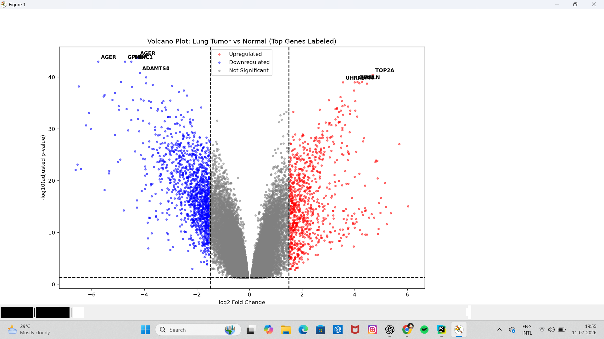
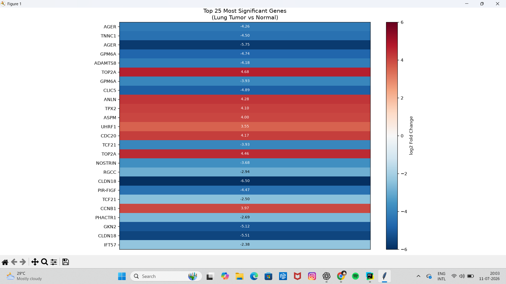

# Lung-Cancer-Differential-Gene-Expression-
Differential gene expression and pathway enrichment analysis of NSCLC tumor vs. normal lung tissue (GEO: GSE18842) — Python, GEO2R, Enrichr


# Differential Gene Expression & Pathway Enrichment Analysis in Lung Cancer (GSE18842)

Independent bioinformatics project analyzing differential gene expression between lung tumor and normal lung tissue, followed by pathway enrichment analysis and validation against known clinical biomarkers.

## Aim

Identify which genes are significantly different in expression between NSCLC (non-small cell lung cancer) tumor tissue and normal lung tissue, and determine what biological processes those genes are involved in — moving from raw statistical differences to a coherent biological interpretation of what's happening in lung cancer at the molecular level.

## Dataset

- **Source:** [GEO accession GSE18842](https://www.ncbi.nlm.nih.gov/geo/query/acc.cgi?acc=GSE18842)
- **Samples:** 46 NSCLC tumor samples vs. 45 normal lung tissue samples
- **Platform:** Microarray (Affymetrix)

## Workflow / Pipeline

```
Raw expression data (GEO2R, ~54,600 probes)
        ↓
Statistical filtering (adj. p-value < 0.05, |log2FC| > 1.5)
        ↓
Upregulated (632 genes) / Downregulated (903 genes)
        ↓
Visualization (volcano plot, heatmap of top genes)
        ↓
Pathway enrichment (Enrichr: KEGG, MSigDB Hallmark, GO Biological Process)
        ↓
Validation against known clinical NSCLC biomarkers
```

## Methods

1. **Differential expression analysis** — performed via GEO2R (limma-based) on the GSE18842 series
2. **Filtering** — genes retained at adjusted p-value < 0.05 and |log2 fold change| > 1.5
3. **Visualization** — Python (`pandas`, `matplotlib`) used to generate a volcano plot and a heatmap of the top 25 most significant genes
4. **Pathway enrichment** — upregulated and downregulated gene lists submitted separately to [Enrichr](https://maayanlab.cloud/Enrichr/), queried against KEGG 2026, MSigDB Hallmark 2020, and GO Biological Process 2026
5. **Biomarker validation** — significant genes cross-referenced against 15 well-established NSCLC biomarkers from the literature

## Key Findings

**Upregulated genes (632)** cluster strongly around **cell cycle and proliferation** pathways — Cell Cycle, DNA Replication, E2F Targets, G2-M Checkpoint — alongside Epithelial-Mesenchymal Transition (EMT) and Glycolysis (Warburg effect), pointing to uncontrolled tumor cell division and increased invasive/metabolic capacity.

**Downregulated genes (903)** cluster around **immune surveillance and tissue structure** pathways — Cell Adhesion, Inflammatory Response, Apoptosis, Extracellular Matrix Assembly — consistent with tumor cells evading immune detection and resisting programmed cell death.

**Biomarker validation:** 27 significant gene entries matched 12 known clinical NSCLC biomarkers, including:
- `MKI67` (Ki-67) — standard clinical proliferation marker
- `TOP2A`, `CDK1`, `CCNB1` — cell cycle drivers / chemotherapy targets
- `CEACAM5` (CEA) — classic blood-based tumor marker
- `AGER`, `SFTPC` — normal lung markers, lost in tumor tissue

This independent recovery of established biomarkers — without specifically searching for them — serves as an internal validation check on the overall analysis.

## Results

| | |
|---|---|
|  |  |
| Volcano plot of differential expression | Heatmap of top 25 significant genes |

Full pathway enrichment charts and the complete biomarker validation table are available in the [report](report/Lung_Cancer_Full_Analysis_Report.pdf).

## Limitations

- Microarray data (not RNA-seq) — lower dynamic range/sensitivity than modern sequencing
- Single dataset — findings not yet replicated across independent cohorts
- Computational/exploratory only — no wet-lab experimental validation performed
- Biomarker matching used a curated literature list, not an exhaustive clinical database

## Repository Structure

```
├── scripts/
│   ├── volcano_plot.py          # Volcano plot generation
│   ├── heatmap.py               # Top-genes heatmap generation
│   └── biomarker_validation.py  # Cross-reference against known biomarkers
├── results/
│   ├── volcano_plot.png
│   └── heatmap.png
└── report/
    └── Lung_Cancer_Full_Analysis_Report.pdf
```

## Tools & Libraries

`Python` · `pandas` · `matplotlib` · `numpy` · GEO2R · Enrichr

## Data Availability

Raw data not included in this repo due to size. Download directly from [GEO: GSE18842](https://www.ncbi.nlm.nih.gov/geo/query/acc.cgi?acc=GSE18842) and run GEO2R to reproduce the differential expression table used here.

---

*Independent portfolio project — 3rd Year Biotechnology, HBTU,Kanpur
